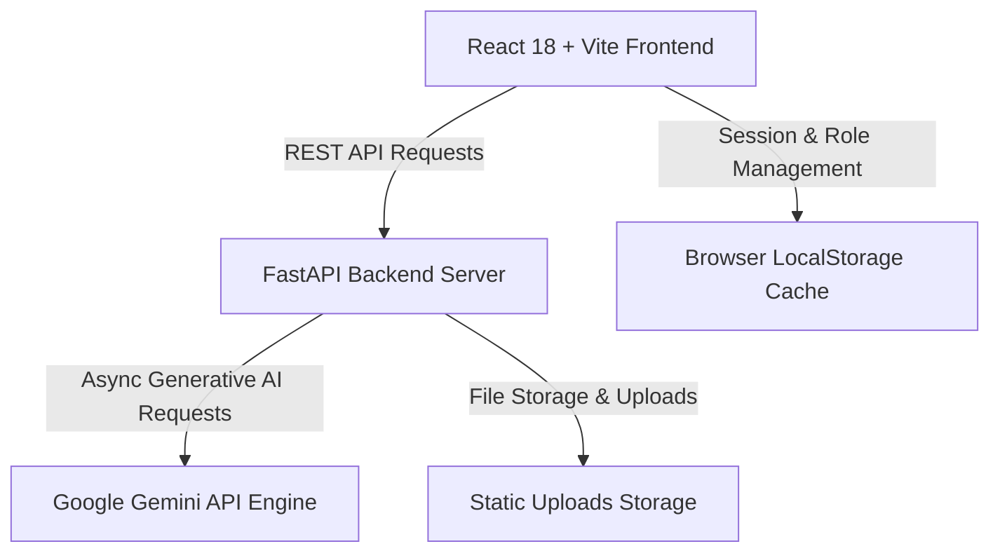

<div align="center">

# 🩺 CareMate AI
### *Next-Generation Doctor & Patient Healthcare Portal powered by AI*

[](https://fastapi.tiangolo.com/)
[](https://react.dev/)
[](https://vitejs.dev/)
[](https://www.python.org/)
[](https://ai.google.dev/)
[](LICENSE)

---

**[💻 Local Demo (http://localhost:5173)](http://localhost:5173/)** &nbsp;|&nbsp; **[📄 API Docs (http://localhost:8000/docs)](http://localhost:8000/docs)** &nbsp;|&nbsp; **[📦 GitHub Repository](https://github.com/Suhas-Saur/care-mate_CAIAS)**

</div>

---

## 📖 Overview

**CareMate AI** is a comprehensive, dual-role digital healthcare platform bridging the gap between patients and healthcare professionals. Designed with a modern user experience and powered by artificial intelligence, CareMate AI provides preliminary medical assessments, personalized nutrition plans, secure medical document storage, and seamless doctor-patient consultations.

---

## 📱 GitHub Mobile App & Local Access Notice

> ⚠️ **Viewing on GitHub Mobile App or Phone?**
> `localhost` links **only open on the desktop machine** running the local server. A mobile phone on GitHub Mobile cannot open `localhost`.
> 
> * **📱 Mobile Access (Same Wi-Fi Network)**: Ensure your development server is running and open **[http://192.168.31.174:5173/](http://192.168.31.174:5173/)** on your phone!
> * **💻 Desktop Access**: Open **[http://localhost:5173/](http://localhost:5173/)** in your desktop web browser.
> * **🌐 Public 24/7 Web Hosting**: See **[Free Web Deployment Guide](#-free-public-web-deployment-optional)** below to deploy a public URL accessible from anywhere on mobile.

| Component | Desktop Link | Mobile / Network Link | Requirements |
| :--- | :--- | :--- | :--- |
| **Frontend App Portal** | [`http://localhost:5173/`](http://localhost:5173/) | [`http://192.168.31.174:5173/`](http://192.168.31.174:5173/) | Run `npm run dev` in `/frontend` |
| **Backend API Server** | [`http://localhost:8000/`](http://localhost:8000/) | [`http://192.168.31.174:8000/`](http://192.168.31.174:8000/) | Run `uvicorn main:app` in `/backend` |
| **Interactive API Docs** | [`http://localhost:8000/docs`](http://localhost:8000/docs) | [`http://192.168.31.174:8000/docs`](http://192.168.31.174:8000/docs) | Backend Server Running |

---

## ⚡ Quick Demo Access & Instant 1-Click Login

Access both **Patient** and **Doctor** portals instantly with **1-Click Quick Login** buttons directly on the login page:

* **⚡ Instant 1-Click Patient Demo**: Click `🧑‍🤝‍🧑 Patient Demo` on the login screen to enter immediately.
* **⚡ Instant 1-Click Doctor Demo**: Click `🩺 Doctor Demo` on the login screen to enter immediately.

Alternatively, test manual login using the pre-populated demo credentials:

| Role | Username | Password | Features Accessible |
| :--- | :--- | :--- | :--- |
| **Patient** 🧑‍🤝‍🧑 | `admin` | `admin123` | AI Symptom Checker, Diet Recommendation Engine, Medical Records Upload/Vault, Doctor Consultations |
| **Doctor** 🩺 | `doctor` | `doctor123` | Clinical Analytics Dashboard, Patient Directory & File Inspector, Consultations Inbox & E-Prescribing |

---

## ✨ Key Features

### 🧑‍⚕️ Patient Portal
* **🩺 AI Symptom Checker**: Describe symptoms in natural language for instant preliminary medical assessment, triage suggestions, and safety recommendations powered by AI.
* **🥗 Personalized Diet Plan Generator**: Input age, height, weight, and health targets to receive customized daily calorie guidelines and structured meal schedules.
* **📁 Medical Records Vault**: Securely upload health reports, lab test PDFs, and diagnostic images with search, view, and deletion capabilities.
* **💬 Direct Doctor Consultations**: Select specialists from the medical panel to initiate online consult queries and receive doctor prescriptions.

### 🩺 Doctor Portal
* **📊 Clinical Analytics Dashboard**: Overview of key medical practice metrics including assigned patient counts, pending consultation cases, and hosted records.
* **👥 Patient Directory & Dossier Inspector**: Access comprehensive demographic profiles (age, height, weight, health goals) and inspect shared clinical files.
* **📥 Consultation Inbox**: View incoming patient consultation threads, review medical descriptions, send clinical advice, and issue electronic prescriptions.

---

## 🌐 Live Local Links

| Component | Port / URL | Description |
| :--- | :--- | :--- |
| **Frontend App** | [`http://localhost:5173/`](http://localhost:5173/) | React + Vite UI Portal |
| **Backend Service** | [`http://localhost:8000/`](http://localhost:8000/) | FastAPI Server |
| **API Docs** | [`http://localhost:8000/docs`](http://localhost:8000/docs) | Interactive OpenAPI / Swagger UI |

---

## 🏗️ Architecture & Tech Stack



* **Frontend**: React 18, Vite 5, CSS3 with Custom Variables, Flexbox/Grid.
* **Backend**: Python 3.10+, FastAPI, Uvicorn ASGI Server, Pydantic data validation, CORS middleware.
* **AI & Machine Learning**: Google Gemini API (`google-generativeai`) with automatic development mock fallback mode.

---

## 🔌 API Endpoints

### 🩺 Symptoms & AI Assessment
* `POST /symptom-check` - Process symptom description string and return preliminary diagnostic feedback.

### 🥗 Nutrition & Diet
* `POST /diet-recommendation` - Calculate caloric needs and generate structured meal plans based on user metrics.

### 📁 Medical Records
* `POST /upload-record` - Upload health files to the secure directory.
* `GET /records` - Fetch list of uploaded medical documents with metadata.
* `DELETE /records/{filename}` - Remove a specific record.
* `DELETE /records` - Clear all uploaded records.

---

## 🚀 Quick Start / How to Run the Local Demo

### Prerequisites
* **Node.js** (v18 or higher)
* **Python** (v3.10 or higher)

### 1. Clone the Repository
```bash
git clone https://github.com/Suhas-Saur/care-mate_CAIAS.git
cd care-mate_CAIAS
```

### 2. Start Backend API Server
```bash
cd backend
python -m venv ../venv

# On Windows:
..\venv\Scripts\Activate.ps1
# On Linux/macOS:
source ../venv/bin/activate

pip install -r requirements.txt
uvicorn main:app --reload --host 127.0.0.1 --port 8000
```

### 3. Start Frontend UI Portal
```bash
# In a new terminal window:
cd frontend
npm install
npm run dev
```

Once started, open **[http://localhost:5173/](http://localhost:5173/)** in your browser!

---

## 🌐 Free Public Web Deployment (Optional)

To host CareMate AI online 24/7 so anyone can access it without running `localhost`:

1. **Frontend (Vercel / Netlify)**:
   - Import the `frontend` folder into [Vercel](https://vercel.com) or [Netlify](https://netlify.com).
   - Framework Preset: `Vite`. Build Command: `npm run build`. Output Directory: `dist`.
2. **Backend (Render / Railway / Render.com)**:
   - Import the `backend` folder into [Render Web Service](https://render.com).
   - Build Command: `pip install -r requirements.txt`.
   - Start Command: `uvicorn main:app --host 0.0.0.0 --port $PORT`.

---

## 📂 Project Directory Structure

```
care-mate_CAIAS/
├── backend/
│   ├── main.py                  # FastAPI Application Entry & Static File Mounting
│   ├── requirements.txt         # Backend Dependencies
│   ├── routes/
│   │   ├── symptom.py           # Symptom Checker API Route
│   │   ├── diet.py              # Diet Recommendation API Route
│   │   └── records.py           # Medical File Storage & Management API Routes
│   └── services/
│       └── ai_service.py        # Gemini AI Client Integration & Fallback Service
├── frontend/
│   ├── index.html
│   ├── package.json
│   ├── vite.config.js
│   └── src/
│       ├── App.jsx              # Main App Routing & Session Role Controller
│       ├── index.css            # Global Theme Variables & Styling
│       ├── components/
│       │   ├── Navbar.jsx       # Header Navigation & Logout Menu
│       │   ├── Sidebar.jsx      # Role-Based Dynamic Navigation Sidebar
│       │   └── ChatBox.jsx      # AI Conversation Container Component
│       ├── pages/
│       │   ├── Login.jsx        # Dual-Role Authentication Login
│       │   ├── Register.jsx     # Patient & Doctor Registration
│       │   ├── Dashboard.jsx    # Patient Central Overview
│       │   ├── SymptomChecker.jsx   # AI Assessment Interface
│       │   ├── DietRecommendation.jsx # Nutrition & Diet Generator
│       │   ├── MedicalRecords.jsx   # Patient Dossier Upload & Vault
│       │   ├── ConsultDoctor.jsx    # Patient Consultation Messaging
│       │   ├── DoctorDashboard.jsx  # Clinical Analytics Dashboard
│       │   ├── PatientDirectory.jsx  # Patient Demographic & File Inspector
│       │   └── DoctorConsultations.jsx # Doctor Consultation Inbox & E-Prescribe
│       └── services/
│           └── api.js           # Frontend API Service Module
└── README.md
```

---

## 🤝 Contributing

Contributions, issues, and feature requests are welcome! Feel free to check the [Issues page](https://github.com/Suhas-Saur/care-mate_CAIAS/issues).

---

## 📜 License

Distributed under the MIT License. See `LICENSE` for more information.

<div align="center">
  <sub>Built with ❤️ by the CareMate Team</sub>
</div>
